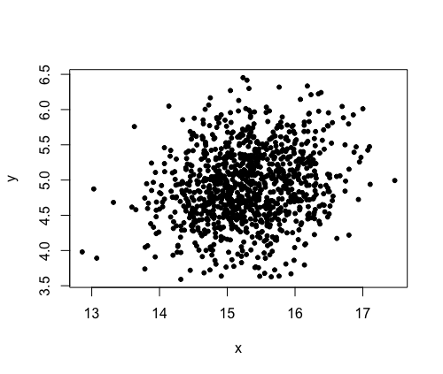
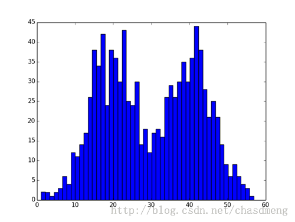
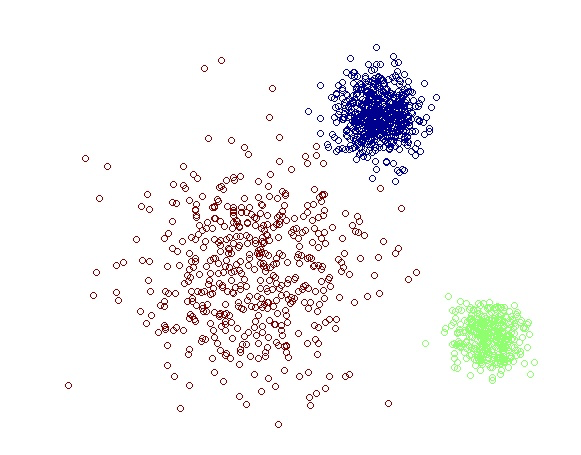

```{r setup, include=FALSE}
knitr::opts_chunk$set(echo = TRUE)
```

---

# 一、贝叶斯分析框架

## 1.1 明确要探究的问题

不管人们是在科研院校做科学实验，在企业部门搞产品研发，还是在投行券商做市场分析，总会遇到各种各样的可变参量。领域不同可能叫法也不一，比如在科学实研中它被称作实验条件，在券商分析报告中它被称作市场因子等等。不管怎样，它本质上都是一系列相互之间存在一定关联性的变量。人们通过对调查一系列变量的排列组合对输出的响应，去探索各个变量与输出间的内在联系，并试图用合理的解释去阐述这种变化，这些不同变量的排列组合就是数据。

对于不同的项目而言，数据的获取成本是不一样的。例如NASA接受到的高清图片，购物网站上关于商品评价的自然语言，监控所拍下的视频记录等等，只要设备不断电，那么这些数据就会源源不断地被生成。为了快速反馈这些大量数据中有核心价值的内容，近年来诸如特征提取，稀疏化模型，深度学习等等追求“模糊的正确”的技术手段不断得到发展，并在实践中得以应用。所以一个互联网企业的AI团队在构建用户画像时，可能并不会为训练数据中漏掉了几个训练样本而感到惋惜。然而在科学研究或是企业的产品研发中，每个“数据”的获取并不像前者那样被动产生，从设计，制备到测试，其耗费的人力物力财力往往是巨大的。设想一个自己牵头的项目，动用各种人员烧掉巨额的经费后，最后却拿到一个各种变量不同排列组合条件下却无明显差别的输出，这样的结果的确会让人感到沮丧。

抽象来看，多个变量对一维输出问题的求解，一直以来都是很多课题频繁遇到的问题。特别是在客观因素都受限的情况下，采取正确的实践方案去推动项目进行显得尤其重要。从最低效的控制变量法，到改进版的实验设计方法，都没能逃出“变量数目依存性”的禁锢，一旦要讨论的变量数目超过一定大小，又或者每个变量的状态空间都是某个范围的实数集时，这些方法所需要测试的样本数量就呈指数级增长，问题本身就变得不可讨论了。因为去设计一个需要动用几十年财政几百年时间几十万人参与才能解决的项目方案，和直接不进行任何设计本身没有什么区别。这还仅是讨论一维输出的情形，如果需要考察多维的输出，即使变量的数量和水平都可控，问题也会变得相当复杂。

因此为了更高效地利用有限样本与尽可能地获得更多的信息，如果能利用数据生成一种可以记录各变量和输出之间相互关系的统计模型，那么目的就达到了。而多元正态分布正好具备这个特点，更重要的是，就像大数定理那样对一元正态分布的描述那样，很多高维问题都是可以依分布收敛于多元正态分布的。举个例子，对于相同的一个课题，某个小的科研团队用10个数据集训练出了多元正态模型A，同时另一个规模较大的科研团队用1000个数据集再用相同的方法训练出了另一个多元正态模型B，假设同时用对这1010个数据利用相同的方法去生成多元正态模型C时，那么C的分布形态理应与B更加接近。

每一个领域内的研究者们为该领域内做出的贡献都是不容忽视的，绝不能因为只采用10个样本的数据集信息量过小，就对小团队的研究成果不屑一顾，也不能因为做出了与过往研究有差别的结果，就对以往的观点予以全盘否定。对于多元正态分布，如果存在一种具有“继承性”的方法，使前人的研究经验，在这个框架下能够为己所用；而自己的研究结果也同样又能以相同的形式，传达给后来的研究者们，那么相同研究领域的人来说，其意义是巨大的。为了达到这个目的，很容易就想到了将多元正态分布的模型装入贝叶斯分析的构架中去。

在贝叶斯框架下的多元正态分布正是这样一种强有力的统计模型，它能够将m个自变量对n个因变量在一定范围内的变化问题进行建模讨论，其中m和n都为不小于1的任意正整数。

## 1.2 回顾一元正态分布

一元正态分布概率密度的标准型如式：

$$f(x)=\frac{1}{\sqrt{2\pi}\sigma}exp[-\frac{1}{2}(\frac{x-\mu}{\sigma})^2] \tag{1}$$
其性质这里不详细展开，大学的数学课本里都应该有相关内容。在贝叶斯框架下，读者需要知道以下两点课本中很可能未提到的性质：

**关于函数的核：**

都知道正态分布由均值$\mu$和方差$\sigma^2$两个参数唯一确定，当这两个参数能够确定时，那么这个正态分布的概率密度也就可以唯一确定了。函数的核，简单来说就是包含一个分布所有参数的一项因子。以正态分布为例，一旦知道了$exp[-{(x-\mu)^2}/{2\sigma^2}]$这一因子后，则$exp$外的系数，或者说概率密度的标准形式也就被唯一确定了（无论$exp$外系数的值为多少，一定会是某一固定正态分布的常数倍，进行归一化后总能得到相同的分布）。因此在看贝叶斯方法时常看到类似下面这样的写法：

$$f(x) \propto exp[-\frac{1}{2}(\frac{x-\mu}{\sigma})^2] \tag{2}$$

这种表达式仅仅把函数的核写出来，但其中所包含的信息量与式（1）是完全一样的。

**关于正态分布参数的快速推定：**

当获得一个分布的其中一项因子（通常是核函数）时，通常需要做两步：第一，确定该分布所属分布族，第二，计算出该分布的参数。以正态分布为例，不妨将式（2）仅关于变量$x$的项展开：

$$f(x) \propto exp[-\frac{1}{2}(\frac{x-\mu}{\sigma})^2] = exp[-\frac{1}{2}(\frac{x^2}{\sigma^2}-\frac{2\mu x}{\sigma^2})] \cdot C \propto exp[-\frac{1}{2}(\frac{x^2}{\sigma^2}-\frac{2\mu x}{\sigma^2})]=exp[-\frac{1}{2}(Ax^2 + Bx)] \tag{3}$$
其中$C$是一个与$x$无关的常数。由此可知，如果当一个分布具有如式（3）这样的形式时，它一定服从于某一正态分布，因为我们总能将它乘以一个与$x$无关的常数，将其恢复成标准形式。解决了第一步，下面继续来看分布参数：当知道了括号里$x$的二次项系数$A$时，很显然$\sigma^2 = A^{-1}$可以被唯一确定，当$x$的一次项系数$B$也确定时，不难发现$A^{-1}B$总是均值$\mu$的-2倍，由此$\mu$也可以被快速推定。

因此总结上述结论就是，当一个分布关于自变量$x$的项可以写成式（3）的形式时，那么它就是个参数可通过$x$的二次项及一次项系数所唯一确定的正态分布。

## 1.3 推广到多元正态分布

假设k维多元正态分布同样含有两个参数，均值向量$\boldsymbol{\mu}$和协方差矩阵$\boldsymbol{\Sigma}$，其标准形式如下：

$$f(\boldsymbol{x})=\frac{1}{\sqrt{(2\pi)^k |\boldsymbol{\Sigma}|}}exp[-\frac{1}{2}(\boldsymbol{x}-\boldsymbol{\mu})^\intercal \boldsymbol{\Sigma}^{-1} (\boldsymbol{x}-\boldsymbol{\mu})] \propto exp[-\frac{1}{2}(\boldsymbol{x}-\boldsymbol{\mu})^\intercal \boldsymbol{\Sigma}^{-1} (\boldsymbol{x}-\boldsymbol{\mu})] \tag{4}$$

将上式仅关于变量$\boldsymbol{x}$展开有：

$$f(\boldsymbol{x}) \propto exp[-\frac{1}{2}(\boldsymbol{x}^\intercal \boldsymbol{\Sigma}^{-1} \boldsymbol{x} - \boldsymbol{x}^\intercal \boldsymbol{\Sigma}^{-1} \boldsymbol{\mu} - \boldsymbol{\mu}^\intercal \boldsymbol{\Sigma}^{-1} \boldsymbol{x} + \boldsymbol{\mu}^\intercal \boldsymbol{\Sigma}^{-1} \boldsymbol{\mu})] = exp[-\frac{1}{2}(\boldsymbol{x}^\intercal \boldsymbol{\Sigma}^{-1} \boldsymbol{x} - 2\boldsymbol{x}^\intercal \boldsymbol{\Sigma}^{-1} \boldsymbol{\mu})] \cdot C \propto exp[-\frac{1}{2}(\boldsymbol{x}^\intercal \boldsymbol{A} \boldsymbol{x} + \boldsymbol{x}^\intercal \boldsymbol{b})] \tag{5}$$

其中$\boldsymbol{A}=\boldsymbol{\Sigma}^{-1}$是一个实对称矩阵，而$\boldsymbol{b}=-2\boldsymbol{\Sigma}^{-1}\boldsymbol{\mu}$是与$\boldsymbol{x}$相同维度的另一向量。对比式（3）不难发现，当向量$\boldsymbol{x}$在小括号里的内容可以写成它的实二次型（向量的二阶形式）和与和另一向量内积（向量的一阶形式）相加的形式时，它就是一个参数可以通过两系数$\boldsymbol{A}$和$\boldsymbol{b}$所唯一确定的多元正态分布，记作$f(\boldsymbol{x}) \sim \mathcal{N}(\boldsymbol{x}|\;\boldsymbol{\mu}, \boldsymbol{\Sigma})$。

## 1.4 多元正态分布下的贝叶斯方法

设均值向量$\boldsymbol{\mu}$的先验分布服从参数为$\boldsymbol{\mu_0}$和$\boldsymbol{\Sigma_0}$的多元正态分布，即：$priori=p(\boldsymbol{\mu}) \sim \mathcal{N}(\boldsymbol{\mu}|\;\boldsymbol{\mu_0}, \boldsymbol{\Sigma_0})$，而样本分布来自于既定先验下的另一多元正态分布$sampling=p(\boldsymbol{x}|\boldsymbol{\mu}) \sim \mathcal{N}(\boldsymbol{x}|\;\boldsymbol{\mu}, \boldsymbol{\Sigma})$，实验共进行了N次采样，根据贝叶斯公式，均值向量$\boldsymbol{\mu}$的后验概率与先验分布和样本分布间存在如下关系：

$$
\begin{align}
p(\boldsymbol{\mu}|\boldsymbol{x}) = \frac{p(\boldsymbol{x}|\boldsymbol{\mu})p(\boldsymbol{\mu})}{p(\boldsymbol{x})} \propto p(\boldsymbol{x}|\boldsymbol{\mu})p(\boldsymbol{\mu})
&= p(\boldsymbol{\mu})\prod_{i=1}^{N}p(\boldsymbol{x_i}|\boldsymbol{\mu}) = exp\{-\frac{1}{2}[(\boldsymbol{\mu}-\boldsymbol{\mu_0})^\intercal \boldsymbol{\Sigma_0}^{-1} (\boldsymbol{\mu}-\boldsymbol{\mu_0})]\}exp\{-\frac{1}{2}[\sum_{i=1}^{N}(\boldsymbol{x_i}-\boldsymbol{\mu})^\intercal \boldsymbol{\Sigma}^{-1} (\boldsymbol{x_i}-\boldsymbol{\mu})]\} \\
&= exp\{-\frac{1}{2}[N\boldsymbol{\mu}^\intercal\boldsymbol{\Sigma}^{-1}\boldsymbol{\mu}+\boldsymbol{\mu}^\intercal\boldsymbol{\Sigma_0}^{-1}\boldsymbol{\mu}-\sum_{i=1}^{N}2\boldsymbol{\mu}^\intercal\boldsymbol{\Sigma}^{-1}\boldsymbol{x_i}-2\boldsymbol{\mu}^\intercal\boldsymbol{\Sigma_0}^{-1}\boldsymbol{\mu_0}] + C\} \\
&= exp\{-\frac{1}{2}[\boldsymbol{\mu}^\intercal(N\boldsymbol{\Sigma}^{-1}+\boldsymbol{\Sigma_0}^{-1})\boldsymbol{\mu}-2\boldsymbol{\mu}^\intercal (\boldsymbol{\Sigma}^{-1} \sum_{i=1}^{N}\boldsymbol{x_i} + \boldsymbol{\Sigma_0}^{-1}\boldsymbol{\mu_0})]\}exp\{C\} \tag{6}
\end{align}
$$

对照式（5）不难发现后验分布$p(\boldsymbol{\mu}|\boldsymbol{x})$仍然是一个多元正态分布，即$p(\boldsymbol{\mu}|\boldsymbol{x}) \sim \mathcal{N}(\boldsymbol{\mu}|\;\boldsymbol{\mu_N}, \boldsymbol{\Sigma_N})$。不难计算出其参数为：$\boldsymbol{\Sigma_N} = (N\boldsymbol{\Sigma}^{-1}+\boldsymbol{\Sigma_0}^{-1})^{-1}$，$\boldsymbol{\mu_N} = \boldsymbol{\Sigma_N}(\boldsymbol{\Sigma}^{-1}\sum_{i=1}^{N}\boldsymbol{x_i}+\boldsymbol{\Sigma_0}^{-1}\boldsymbol{\mu_0})$。

可以看出，后验分布的参数受先验分布和样本分布的共同影响。当N还比较小时，先验分布的影响为较明显，而当N逐渐增大时，后验分布的形态逐渐向样本似然估计$\prod_{i=1}^{N}p(\boldsymbol{x_i}|\boldsymbol{\mu})$的形态靠近，这样的结论很符合直觉。为了用具体的例子把这个抽象的概念阐明，先调用```MVNBayesian```工具包：

```{r message=FALSE, paged.print=FALSE}
library(MVNBayesian)
set.seed(9)
```

当我从别人手里拿到一个样本，别人告诉我说这个样本主要由三种成份构成，它们是按照80:16:3的配比制备成的（先验经验），但在实际制备过程中可能由于种种原因，成份会产生偏差，因而需要将三种成分进行校准。我对样本进行了25次测试，并结果放在dataset1里：

```{r}
summary(dataset1)
```

如果直接采用矩法进行估计，那么将会得到这样的样本均值：

```{r}
colMeans(dataset1)
```

而如果采用给定先验（协方差矩阵为默认的3*3单位矩阵），用贝叶斯后验对其估计，则有：
```{r}
Bayesian_ES <- MVN_BayesianPosteriori(dataset1, c(80, 16, 3))
Bayesian_mean <- as.vector(t(Bayesian_ES$mean))
Bayesian_mean
```

从结果看来，与直接取样本均值相比，似乎第一和第三个成份的贝叶斯后验估计更接近于给定的先验。

实际上，前面所讨论的贝叶斯后验会根据根据样本大小而发生变化的性质，可以通过下面的段代码简单验证：

```{r}
for (i in 1:5){
  a <- MVN_BayesianPosteriori(dataset1[1:(i+20),],c(80,16,3))
  b <- as.vector(t(a$mean))
  print(b)
}
```

每次都采用相同的先验信息，而随着使用的样本数量N从21增加至25，后验均值的结果也逐渐从接近先验的结果向接近样本均值的方向靠拢了。

使用贝叶斯方法对参数进行分析，其意义远远不止获得了一个与样本均值不太一样的结果那么简单。它综合考虑了在进行实验的过程中，样本量大小这个因素。简单来说，它具有以下三方面的优点：

一、量化了样本数目对分布参数的影响：直观上来说，解决了诸如“在样本量十分小时，我该给予先验信息多大程度的信任”或者“在样本量足够大时，我该多大程度地相信自己的实验结果”这样的问题；

二、相对闭环的系统结构保证了课题研究的连续性：对于任取的满足多元正态分布的给定先验，如果加上在该先验条件下的任意样本观测值（条件分布同属多元正态分布），我们就一定能得到一个仍属于多元正态分布族的后验分布（共轭性质）。先验分布与后验分布之间能够相互转化，就意味着在多元正态分布的贝叶斯框架下，前人的研究结果可以作为一种先验分布，为自己所用；而自己通过实验修正的后验结果，又可以作为后继研究者们的先验信息，被继续加以利用。

三、它仅仅通过一系列离散的观测值，就能够在观测的邻域内构建起一个“连续”的概率密度，即使不需要做大量的实验，也能够对该分布附近任意参数的各种搭配作出较基于后验概率的预测。

---

# 二、满条件分布与吉布斯采样器

## 2.1 多元正态分布的满条件分布

假设实验有一组（$i$个）观察值$\boldsymbol{x_i}=(x_{i1},...,x_{ik})$，每个观测值为$k$维随机变量，对应一个输出$y_i$。为讨论多变量与一维输出之间的关系，把每个数据点写成观测值的$k+1$维接长向量的形式$\boldsymbol{x_{i}'} = (x_{i1},...,x_{ik}, y_i)$，假设其符合$k+1$元正态分布，选择合适的先验，就可以把实验数据和先验传入```MVN_BayesianPosteriori()```函数，利用前述的方法输出$\boldsymbol{x_{i}'}$的后验分布参数，从而该邻域内的概率分布也就唯一确定了。换句话说，一旦```MVN_BayesianPosteriori()```函数输出成功，联合概率分布$p(y,\boldsymbol{x})=p(y,x_1,...,x_k) \sim \mathcal{N}(y,\boldsymbol{x}|\;\boldsymbol{\mu_i},\boldsymbol{\Sigma_i})$就能被唯一确定了。有了联合概率分布，研究者下一步自然就想，知道怎样通过它来对于一个全新的观测值$\boldsymbol{x_j}=(x_{j1},...,x_{jk})$对应的输出$y_j$做出预测呢？在其余的$k$维变量都确定的情况下，即已知$(x_1=x_{j1},...,x_k=x_{jk})$时，所要计算的条件概率$p(y|x_1=x_{j1},...,x_k=x_{jk})$为多元正态分布在$k+1$维的满条件分布。

考察$n$元正态分布，用精度矩阵替换协方差矩阵($\boldsymbol{\Lambda}=\boldsymbol{\Sigma}^{-1}$)，将向量与矩阵分别写成如下分块矩阵的形式后有：

$$p(\boldsymbol{x}|\boldsymbol{\mu},\boldsymbol{\Sigma}) \propto exp[-\frac{1}{2}(\boldsymbol{x}-\boldsymbol{\mu})^\intercal \boldsymbol{\Lambda} (\boldsymbol{x}-\boldsymbol{\mu})] = exp\{-\frac{1}{2}[(\left[\begin{array}{}x_1\\\boldsymbol{x_{n-1}}\end{array}\right]-\left[\begin{array}{}\mu_1\\\boldsymbol{\mu_{n-1}}\end{array}\right])^\intercal \left[\begin{array}{}\lambda_{1,1} &\boldsymbol{\Lambda_{1,n-1}}\\\boldsymbol{\Lambda_{n-1,1}} &\boldsymbol{\Lambda_{n-1,n-1}} \end{array}\right]  (\left[\begin{array}{}x_1\\\boldsymbol{x_{n-1}}\end{array}\right]-\left[\begin{array}{}\mu_1\\\boldsymbol{\mu_{n-1}}\end{array}\right])]\} \tag{7}$$
在$\boldsymbol{x_{n-1}}$已知的情况下，条件概率$p(x_1|\boldsymbol{x_{n-1}},\boldsymbol{\mu},\boldsymbol{\Lambda})$的唯一变量为$x_1$。通过对式（7）使用分块矩阵乘法后有：

$$
\begin{align}
p(x_1|\boldsymbol{x_{n-1}},\boldsymbol{\mu},\boldsymbol{\Lambda}) &\propto exp\{-\frac{1}{2}[(x_1-\mu_1)^\intercal \lambda_{1,1} (x_1-\mu_1)+(\boldsymbol{x_{n-1}-\boldsymbol{\mu_{n-1}}})^\intercal\boldsymbol{\Lambda_{n-1,1}}(x_1-\mu_1)+(x_1-\mu_1)^\intercal\boldsymbol{\Lambda_{n-1,1}}(\boldsymbol{x_{n-1}-\boldsymbol{\mu_{n-1}}})]+C\} \\
&=exp\{-\frac{1}{2}[\lambda_{1,1}x_1^2-2x_1(\lambda_{1,1}\mu_1-\boldsymbol{\Lambda_{1,n-1}(\boldsymbol{x_{n-1}}-\boldsymbol{\mu_{n-1}})})]\}exp\{C'\} \qquad(\because\boldsymbol{\Lambda_{n-1,1}}^\intercal = \boldsymbol{\Lambda_{1,n-1}})
\tag{8}
\end{align}
$$

对照式（3）发现，对于一个参数已知的$k$维多元正态分布而言，如果它其余的任意$k-1$维的值都已知，那么余下的$1$维在其余$k-1$维已知情况下的（满）条件概率满足正态分布$p(x_1|\boldsymbol{x_{n-1}},\boldsymbol{\mu},\boldsymbol{\Lambda}) \sim \mathcal{N}(\mu_{m1},\sigma_{m1}^2)$。

这个正态分布的参数$(\mu_{m1},\sigma_{m1}^2)$中含有形为$\lambda_{1,1}$和$\boldsymbol{\Lambda_{1,n-1}}$的数或矩阵。这些数和矩阵是被定义在精度矩阵（未知）里的，它们与协方差矩阵（已知）存在如下关系：

$$\boldsymbol{\Lambda} = \left[\begin{array}{}\lambda_{1,1} &\boldsymbol{\Lambda_{1,n-1}}\\\boldsymbol{\Lambda_{n-1,1}} &\boldsymbol{\Lambda_{n-1,n-1}} \end{array}\right]=\left[\begin{array}{}\sigma_1^2 &\boldsymbol{\Sigma_{1,n-1}}\\\boldsymbol{\Sigma_{n-1,1}} &\boldsymbol{\Sigma_{n-1,n-1}} \end{array}\right]^{-1}= \boldsymbol{\Sigma}^{-1} \tag{9}$$

根据[Sherman-Morrison-Woodbury公式](https://ccjou.wordpress.com/2009/03/17/二矩陣和的逆矩陣/)，对分块矩阵求逆（第四部分），可得：

$$
\begin{align}
\lambda_{1,1} &= (\sigma_1^2-\boldsymbol{\Sigma_{1,n-1}}\boldsymbol{\Sigma_{n-1,n-1}}^{-1}\boldsymbol{\Sigma_{n-1,1}})^{-1} \\
\boldsymbol{\Lambda_{1,n-1}} &= -(\sigma_1^2-\boldsymbol{\Sigma_{1,n-1}}\boldsymbol{\Sigma_{n-1,n-1}}^{-1}\boldsymbol{\Sigma_{n-1,1}})^{-1}\boldsymbol{\Sigma_{1,n-1}}\boldsymbol{\Sigma_{n-1,n-1}}^{-1}
\tag{10}
\end{align}
$$

分别代入式（8）中的系数，可计算出$x_1$满条件正态分布的参数$(\mu_{m1},\sigma_{m1}^2)$分别为：

$$
\begin{align}
\mu_{m1} &= \mu_1 + \boldsymbol{\Sigma_{1,n-1}}\boldsymbol{\Sigma_{n-1,n-1}}^{-1}(\boldsymbol{x_{n-1}}-\boldsymbol{\mu_{n-1}}) \\
\sigma_{m1}^2 &= (\sigma_1^2-\boldsymbol{\Sigma_{1,n-1}}\boldsymbol{\Sigma_{n-1,n-1}}^{-1}\boldsymbol{\Sigma_{n-1,1}})
\tag{11}
\end{align}
$$

**1.4** 节里已经把贝叶斯后验存入了名为```Bayesian_ES```的变量中。假设```dataset1```里的fac2和fac3分别为自变量，fac3为因变量（输出），在得到后验分布的情况下，如果想要预测当fac2=13，fac3=4时，因变量fac1服从怎样的条件分布，就可以通过上述过程进行计算。```MVNBayesian```将这一繁琐的计算过程封入了```MVN_FConditional()```函数，它的第一个变量data用来接收```MVN_BayesianPosteriori()```生成的后验；第二个变量variable应为一个整型变量，用来指定计算第几个变量的满条件分布，在预测第一列fac1时，需把variable设置成1；第三个变量z是用来指定条件的向量，当需要预测fac2=13，fac3=4的情况，设置成z=c(80,13,4)即可。在variable设置成1时，z中的第一个值80并不会参与计算，因而不会影响最终的结果。利用```MVN_FConditional()```函数将fac1的上述满条件分布的两个参数存入变量```Bayesian_m1```中：

```{r}
Bayesian_m1 <- MVN_FConditional(Bayesian_ES, 1, c(80,13,4))
Bayesian_m1
```

利用随机数生成器，对fac1的满条件分布进行可视化：

```{r}
fac1_m <- rnorm(1000, Bayesian_m1$mean, Bayesian_m1$var)
hist(fac1_m,freq = F, main = "Histogram of fac1 | fac2=13, fac3=4", xlab = "fac1", ylab = "frequency (*100.%)")
```

通过这样的方法就可以简单推断，在fac2=13，fac3=4的条件下，fac1大概服从一个均值为79.225附近，方差为0.006左右的正态分布。

任何关于多变量对一维输出的问题，都可以按前述方法将变量与输出合成成一个接长向量，在多元正态分布的框架下生成后验多元正态模型。利用多元正态满条件分布的特性，在变量取不同值时，利用```MVN_FConditional()```函数计算单一输出的满条件分布，从而能够实现对不同变量特定取值下的简单预测。

## 2.2 吉布斯采样器

有时候，研究者们利用实验数据及先验分布计算出了贝叶斯后验分布，例如$p(x_1,x_2,x_3,x_4)$，但依照情况不同，并不是所有变量都要参与每一次的讨论。比如有时候他们只想关注$x_1$与$x_2$之间存在何种联系，换句话说，如果能够通过$p(x_1,x_2,x_3,x_4)$按定义去计算出$p(x_1,x_2)=\int_{x_3}\int_{x_4}p(x_1,x_2,x_3,x_4)dx_3dx_4$，就获得了最后想要的结果。这时有人会考虑，既然都有了实验数据和既定先验，为什么不尝试用只含有$x_1$与$x_2$列的子集去重新生成一个后验分布呢？以```dataset1```为例，如果尝试每次都取fac1，fac2和fac3中的两者重新生成后验时，用以下代码试试会产生什么结果：

```{r}
fac1_fac2 <- MVN_BayesianPosteriori(dataset1[,1:2],c(80,16))
fac1_fac2
fac2_fac3 <- MVN_BayesianPosteriori(dataset1[,2:3],c(16,3))
fac2_fac3
fac1_fac3 <- MVN_BayesianPosteriori(dataset1[,c(1,3)],c(80,3))
fac1_fac3
Bayesian_ES
```

结果不仅均值，连协方差矩阵与```Bayesian_ES$var```的子集相对比每次都存在较大差异！原因展开来讲比较复杂，考虑以下一个简单例子：



x和y根据某二元正态分布生成的随机数，当需要计算x或y的边缘分布时，只需把上图分别沿着y和x方向压扁即可。这样就可以分别计算得到x和y的均值和方差：x_mean，x_var，y_mean，y_var。但如果我们尝试使用一维的生成模型（x_mean，x_var）和（y_mean，y_var）去描述这个二元正态分布时，均值向量x_y_mean=c(x_mean, y_mean)看起来似乎问题不大，然而轮到了另一个参数协方差矩阵的话：

$$x\_y\_var = \left[\begin{array}{}x\_var &\boldsymbol{?}\\\boldsymbol{?} &y\_var \end{array}\right] $$

x和y之间的协方差从两个低维的生成模型的参数中是看不到任何定义的。这个例子明显看出，用高维的生成模型去描述低维的分布本身没有问题，但要用低维的生成模型去描述高维的分布，则很容易“以偏概全”，造成信息的缺失。上述对fac1，fac2和fac3的两两生成模型也正是一个这样的例子。

既然如此，如果能有一个随机数生成器，在给定了多元正态分布的参数后，能够按照该分布产生随机数。例如$p(x_1,x_2,x_3,x_4)$，那么如果我们要计算边缘密度$p(x_1,x_2)$，并不需要按定义进行积分，而是通过将“按联合概率$p(x_1,x_2,x_3,x_4)$”生成的随机数的前两列子列提取出来即可。

对于构建多元正态分布的随机数生成器而言，由于多元正态分布的每一个满条件分布都是一个正态分布，吉布斯采样自然就是最合适的选择。若要详细了解吉布斯采样，可以参考关于MCMC方法的经典教材《Monte Carlo statistical methods》(by Robert, Christian, Casella, George)。```MVNBayesian```包里提供了```MVN_GibbsSampler()```函数可以按给定的多元正态分布生成随机数，以```dataset1```的后验为例：

```{r}
BP_Gibbs <- MVN_GibbsSampler(4000, Bayesian_ES)
colMeans(BP_Gibbs)
var(BP_Gibbs)
```

这样的结果显然与贝叶斯后验十分接近。另外关于MCMC方法中的初始值，预烧期等设置，```MVN_GibbsSampler()```函数里都有相关定义，可以参考帮助文档使用。上述演示只使用了设置的默认值。

对比只用fac2和fac3两列子集生成的后验模型：

```{r}
fac2_fac3
```

与使用吉布斯采样估计的fac2与fac3的联合分布p(fac2,fac3)：

```{r}
colMeans(BP_Gibbs[,2:3])
var(BP_Gibbs[,2:3])
```

显然吉布斯采样获得的边缘分布更接近于实际情况。

---

# 三、马科夫链蒙特卡洛（MCMC）与多元正态条件概率

## 3.1 多元正态分布的条件概率

很多时候研究者们不仅需要讨论联合概率分布$p(x_1,x_2,x_3,x_4)$的边缘分布$p(x_1,x_2)$，有时候他们可能更关心在特定条件如$x_3=a,\;x_4=b$情况下的条件概率$p(x_1,x_2|\;x_3=a,\;x_4=b)$。虽然**2.1**节对满条件概率的演示似乎也能解决大多数问题，但这只是所有条件概率中的极为特殊的一种情况，它对应着多变量对一维输出的一类问题。如果问题本身就是多维变量对多维输出的模型，比如让刚才例子中的$x_3$代表样本处理温度，让$x_4$代表样本处理时间，$x_1$和$x_2$分别代表“样本表面粗糙度”和“样本内部均匀性”两个可量化的变量，如果想要预测的结果是“在某种特定处理温度和处理时间”的搭配下，“样本表面粗糙度”和“样本内部均匀性”会存在怎样一种关系，那么使用满条件概率的方法就会显得相当乏力了：这主要是因为，如果使用满条件分布的方法，则势必会对两个输出$x_1$和$x_2$分开做后验估计，分别计算出$p'(x_1, x_3, x_4)$和$p'(x_2, x_3, x_4)$，然后再使用满条件概率逐一求算。但就像**2.2**节开始展示的那样，用低维的模型参数去描述高维的模型很容易造成信息的缺失，这种估计本身就是不准确的。

既然知道了后验模型$p(x_1,x_2,x_3,x_4)$，怎么去计算$x_3=a,\;x_4=b$情况下的条件概率$p(x_1,x_2|x_3=a,\;x_4=b)$呢？首先考虑$(x_3,\;x_4)$的一个支撑集$S\{x_3=a,\;x_4=b\}\cup S\{x_3 \neq a,\;x_4 \neq b\}$，写成全概率公式：

$$
\begin{align}
p(x_1,x_2) &= p(x_1,x_2|\; x_3=a,\;x_4=b)p(x_3=a,\;x_4=b) + p(x_1,x_2|\; x_3\ne a,\;x_4\ne b)p(x_3\ne a,\;x_4\ne b) \\
&= p(x_1,x_2|\; x_3=a,\;x_4=b)p(x_3=a,\;x_4=b) + p(x_1,x_2|\; x_3\ne a,\;x_4\ne b)(1-p(x_3=a,\;x_4=b))
\tag{12}
\end{align}
$$
**2.2**节已经介绍了如何用随机数模拟边缘概率$p(x_1,x_2)$。从式（12）来看，它是由两部分，即$p(x_1,x_2|\; x_3=a,\;x_4=b)$和$p(x_1,x_2|\; x_3\ne a,\;x_4\ne b)$所构成的。式中的未知变量似乎只有$p(x_3=a,\;x_4=b)$一项了。如果能够计算出$p(x_3=a,\;x_4=b)$，然后按规则把$p(x_1,x_2)$分割成两部分，从中提取出我们所关心的那部分随机数，那么这就是条件概率$p(x_1,x_2|\;x_3=a,\;x_4=b)$的一个近似结果。

## 3.2 马科夫链蒙特卡洛方法

再看$p(x_3=a,\;x_4=b)$，它是来自四维空间中由$x_1$和$x_2$所决定的一个平面。不妨降维来思考，考察一个四维空间中某一平面的占比，就像类似于考察一个三维空间中某条直线的体积，或者一个二维空间中某个点的长度，其结果都将会是0！代回式（12）就会发现，好像一切问题又回到了原点。

为了说明蒙特卡洛的核心思想，这里以三维空间举例：考虑某个三元正态分布$p(x_1, x_2, x_2)$，将它的两个低维的边缘分布按照式（12）的方法写成全概率公式：

$$p(x_1, x_2) = p(x_1, x_2|\; x_3 = a)p(x_3 = a) + ...; \qquad p(x_1) = p(x_1|\; x_2=b,x_3=c)p(x_2=b,x_3=c)+... \tag{13}$$
$p(x_3 = a)$是三维空间中某一平面，而$p(x_2=b,x_3=c)$是三维空间中某一直线，它们本身是不具备任何体积的。如果我们设定一个很小的正整数$\delta$，并假设$p(x_3 = a) \approx p(x_3 \in [a-\delta,a+\delta])$以及$p(x_2=b,x_3=c) \approx p(x_2 \leq b+\delta cos\theta, x_3 \leq c+\delta sin\theta; \; \theta \in [0, 2\pi])$，不难发现，$p(x_3 \in [a-\delta,a+\delta])$和$p(x_2 \leq b+\delta cos\theta, x_3 \leq c+\delta sin\theta; \; \theta \in [0, 2\pi])$就变成了具有一定厚度的平板和一根无限长的圆柱，它们在三维空间中都是具有“确定体积”的。

蒙特卡洛的核心思想简而言之，如果有一个随机数生成器，能够按照联合概率分布$p(x_1, x_2, x_2)$来生成大量的随机点，就一定会有一部分的点落在这样的平板或者圆柱内部。通过计算落在内部的点的数目与生成随机点的总数的比值，就可以近似求得$p(x_3 = a)$和$p(x_2=b,x_3=c)$的概率。而把落入体积内部的点标记，然后作为一个子集整体提出来，把它们分别向特定的面，或特定的直线上投影，就可以得到条件概率$p(x_1, x_2|\; x_3 = a)$和$p(x_1|\; x_2=b,x_3=c)$的近似。

通过```MVNBayesian```包中的函数```MVN_MCMC()```就可以实现上述功能。它的第一个参数```data```用来接受多元正态分布的参数，在贝叶斯框架上通常为```MVN_BayesianPosteriori()```函数输出的后验分布；第二个参数```steps```指定生成随机数的数量。```pars```和```values```应为相同长度的数值型向量，其中```pars```中的值应为整数。它们分别用来指定需要固定的条件分布所在维度，以及给定的值。例如对于**1.4**节里的贝叶斯后验分布```Bayesian_ES```，如果想知道当fac=78时，fac2对fac3是如何响应的，则可以通过以下代码：

```{r}
BP_MCMC <- MVN_MCMC(Bayesian_ES, steps=8000, pars=c(1), values=c(78), tol=0.3, burn=0)
MCMC <- BP_MCMC$MCMCdata
head(MCMC)
dim(MCMC)
print(BP_MCMC$AcceptRate)
```

这里的```tol```指tolerance，即之前提到的正整数$\delta$。可以看出，在fac1=78的情况下，一共生成了8000个随机数，在0.3的宽容度内，有约百分之三十的点被接受了。上述代码第二行将所有的随机数提取并存入```MCMC```变量。为了求边缘密度$p(fac2, fac3)$，按照**2.2**节里的方法，将```MCMC```中的第二，三列子列提取出来并作图：

```{r}
Marginal_D <- MCMC[,2:3]
plot(Marginal_D[,1], Marginal_D[,2], pch=20, col="red", xlab = "fac2", ylab = "fac3", main = "p(fac2, fac3)")
```

这个结果对应着将$fac1$积分后获得的边缘概率近似，结果似乎非常凌乱，看不出什两变量间存在什么联系。然而如果将落入$fac1=78\pm0.3$的那部分点（```BP_MCMC$Accept```）单独取出并可视化，将获得条件概率$p(fac2, fac3|\; fac1=78)$的近似：

```{r}
Conditional_D <- BP_MCMC$Accept[,2:3]
plot(Conditional_D[,1], Conditional_D[,2], pch=20, col="red", xlab = "fac2", ylab = "fac3", main = "p(fac2, fac3| fac1=78)")
```

可以看出，当指定了条件fac1=78以后，两变量间的线性依存关系就已经一目了然了。如果想指定条件fac2=14.5，fac3=4，则在```MVN_MCMC()```步分别把```pars```和```values```设置为c(2, 3)和c(14.5, 4)即可。只要明确所分析的问题，设置合适的条件，用蒙特卡洛的方法一般都能很快地获得结果。

# 四、多元正态分布的局限性与混合多元正态分布

有了贝叶斯框架下的多元正态分布，似乎看上去很多问题都可以通过建立统计模型去解决了，但实则不然。这种想法就好像能用一元正态分布解决所有的一维问题，能用二元正态分布去解决所有的二维问一样，生搬硬套很可能出现严重违背事实的结果。因为现实中通常遇到的一维问题有可能是这样的（图片来自互联网）：



遇到的二维问题也很有可能是这样的：



多元正态分布就像上面两幅图一样，能够在空间中的某个局部区域保持良好的相似性，但一旦离开这个局部区域，其形态很可能就会偏向于完全不同的另一种多元正态分布。现实中遇到的很多可能都可以归类于这样的问题，幸运的是，就像探案剥丝抽茧一样，这样的问题同样也可以被拆解为一个个独立的多元正态分布来进行分析探讨。以图3为例，设$N_1$，$N_2$和$N_3$分别对应蓝、绿、褐色部分的二元正态分布，那么图3中的问题就可以用以下概率模型来进行描述：

$$p=p_1 N_1 + p_2 N_2 + p_3 N_3; \qquad (p_1 + p_2 + p_3 =1) \tag{14}$$

式（14）就是多元混合正态分布在具体到图3的问题时的一种表述。关于混合多元正态分布，```MVNBayesian```提供了```MixMVN_BayesianPosteriori()```，```MixMVN_GibbsSampler()```和```MixMVN_MCMC()```三个函数。混合参数$p_1$或$p_2$的求法属于聚类问题，```MixMVN_BayesianPosteriori()```虽然默认使用的是```kmeans```方法，但这并不是固定的。研究者也可以使用其它的聚类算法如EM等等，将聚类结果传入```MixMVN_BayesianPosteriori()```中的```idx```参数，从而根据自己所研究的实际问题，计算得定制的混合多元正态分布后验，以进行更进一步的模拟或分析。

关于混合多元正态分布三个函数的用法，读者可自行参阅帮助文档，用```MVNBayesian```里的```dataset2```或者大名鼎鼎的```iris3```亲自动手实践一下。
